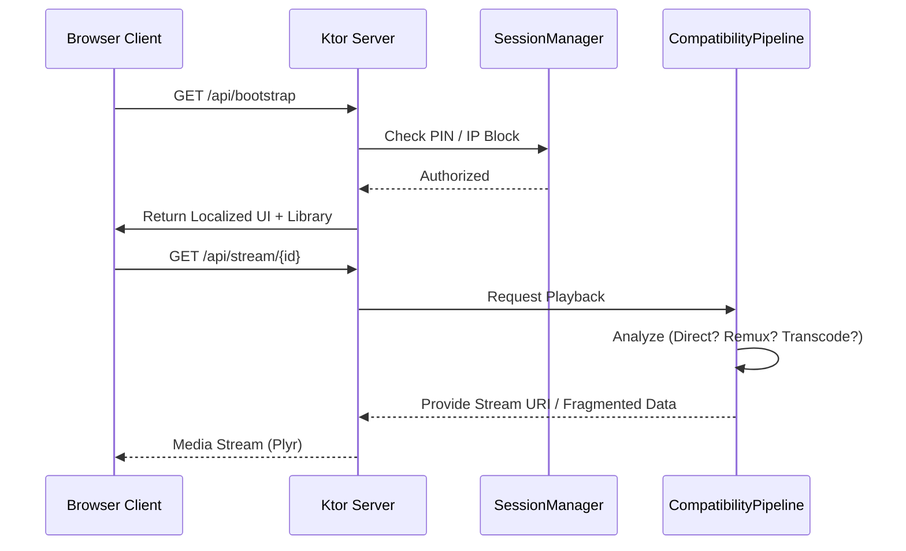

# GhostStream Technical & Functional Manual

GhostStream (Internal Project Name: **DirectServe**) is a privacy-first, high-performance media sharing application. It allows users to host a temporary, localized media server on their Android device, enabling browsers on other devices (Phones, PCs, TVs) to stream videos, photos, and music without installing any apps.

---

## 🏗️ Architecture & Tech Stack

DirectServe is built with a **Clean Architecture** approach using a multi-module Gradle project structure. This ensures separation of concerns between core logic (Ktor, Media) and UI features (Compose).

### 🛠️ Core Tech Stack
| Layer | Technologies |
| :--- | :--- |
| **Language** | Kotlin (100%) |
| **UI Framework** | Jetpack Compose |
| **Server Engine** | Ktor (CIO Engine) |
| **Web Frontend** | Vanilla JavaScript, CSS Grid/Flexbox |
| **Media Engine** | MediaExtractor, MediaCodec, Fragments of MP4 |
| **Web Player** | Plyr.js, Hls.js |
| **Remote Uploads** | Uppy.js / XMLHttpRequest |
| **State Management** | Kotlin Coroutines & Flow |

### 📂 Module Structure
- `:app`: Entry point, Application class, and the Persistent Foreground Service.
- `:core:network`: The Ktor-powered server core and Network Inspection logic.
- `:core:media`: Intelligent media analyzer and the Compatibility Pipeline.
- `:core:session`: Coordination of active sharing, security, and NSD discovery.
- `:core:resources`: Localization hub for all 26 supported languages.
- `:feature:*`: Modular UI screens (Library, Home, Settings, Session).
- `:webassets`: The static assets (JS, CSS, HTML) served to browser clients.

---

## 🚀 Core Functionality

### 1. Media Sharing (Sender -> Receiver)
The primary mode of operation. The Android device acts as a **Dynamic Content Server**.
- **Discovery**: Uses **mDNS/NSD (Network Service Discovery)** to broadcast the session. Other devices on the Wi-Fi see "DirectServe" as a nearby service.
- **Bootstrapping**: When a browser hits the local URL, the server sends a JSON payload (`/api/bootstrap`) containing localized UI strings, session info, and the file library.
- **Adaptive Playback**: If a video is in an incompatible format (e.g., MKV/H.265), the app automatically prepares a browser-ready stream.

### 2. Reverse Sharing (Receiver -> Sender)
Allows browser users to upload files back to the Android device.
- **Request Flow**: A receiver asks to upload. The Android device owner receives a **system notification** to Accept or Decline.
- **Conflict Handling**: Multiple clients can request uploads simultaneously; the owner manages the queue.

### 3. Localization Pipeline
DirectServe features a unique **Dual-Registry Localization** system.
- **Android Side**: 26 standard `strings.xml` files.
- **Web Side**: The Android server reads the active locale, extracts the corresponding strings, and injects them into the web client's bootstrap data. This ensures 100% linguistic parity between the app and the website.

---

## 🔍 Minute Technical Details

### 🔄 The Compatibility Pipeline (The "Brain")
This is the most complex part of GhostStream. It decides how a file is served:
1. **DIRECT**: Raw file served (H.264/AAC in MP4/WebM).
2. **REMUX**: Video/Audio tracks are compatible but the container (MKV/MOV) is not. The app swaps the "wrapper" on the fly without re-encoding.
3. **TRANSCODE**: Tracks are incompatible (H.265/High10). The app uses a **Growing MP4 / HLS Fragment** system to stream the video *while* it is being re-encoded, avoiding a long wait.

### 🍎 Apple/Safari HLS Implementation
Safari on iOS has strict requirements for streaming. DirectServe detects Apple devices via User-Agent and serves an **HLS (m3u8) Playlist**. The segments are generated in real-time by the `CompatibilityWorker` and cleaned up after the session ends.

### 🔐 Security & Auth Model
- **PIN System**: Uses a 6-digit PIN which can be auto-generated or manual.
- **Cookie Auth**: Once the PIN is verified, the server issues a session cookie. This allows the user to browse without re-entering the PIN until the session is stopped.
- **IP Blocking**: The owner can see the IP of every connected device and block them permanently from the foreground service.
- **Network Guards**: The server only starts if it detects a private local network (Wi-Fi, Ethernet, or Hotspot) to prevent accidental exposure to the cellular network.

### 👻 Ghost Mode (Privacy)
When "Ghost Mode" is enabled:
- No file selection is saved between sessions.
- All transcoding caches and thumbnails are wiped immediately upon stopping.
- The browser authentication tokens are invalidated server-side.

---

## 🛠️ Maintenance & Extension

### Adding a New Language
1. Add a new `values-XX/strings.xml` in `:core:resources`.
2. Register the language in `AppLanguage.kt`.
3. The server will automatically detect and serve the new strings to the web UI.

### Modifying the Web UI
The web UI is located in `webassets/src/main/assets/web/`.
- `app.js`: Main logic (Routing, UI Rendering).
- `app.css`: The "Glassmorphism" design system.
- Changes are served instantly by the server without rebuilding the entire APK (useful for rapid UI iteration).

---

## 🗺️ Information Flow Diagram

**DirectServe version 1.0 - Documentation Finalized.**
